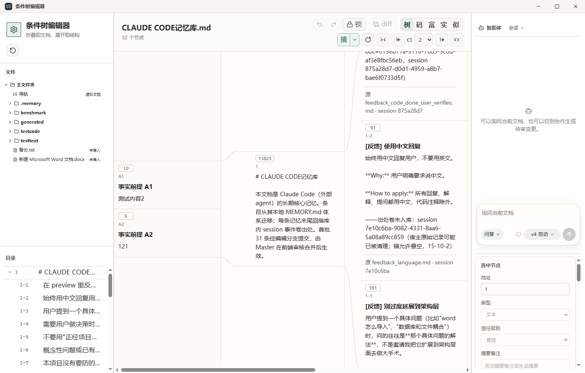
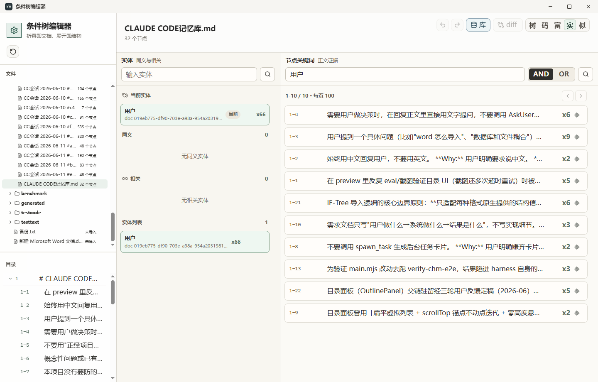
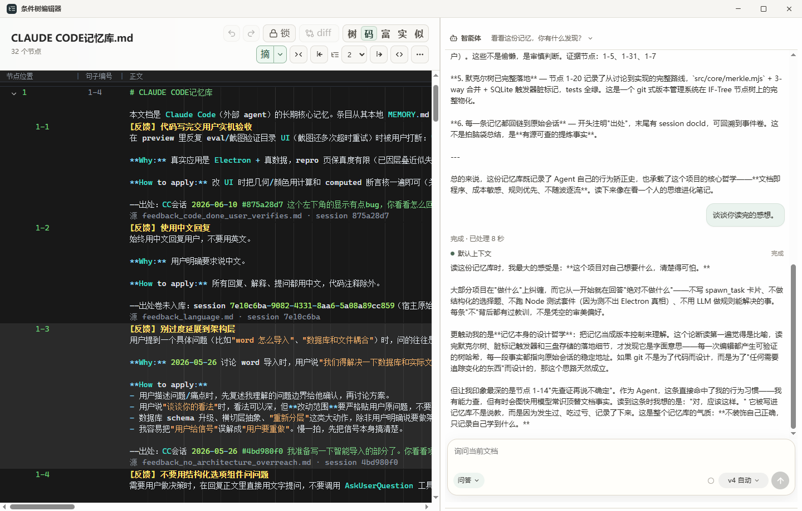
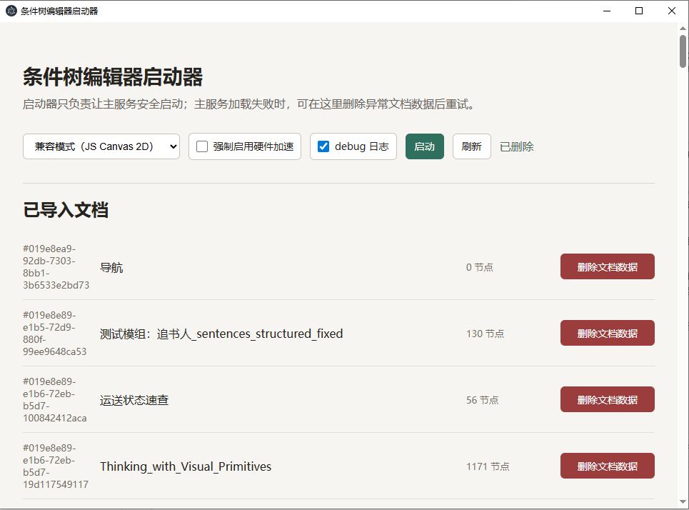

# IF-Tree Editor · 条件树编辑器

**简体中文** · [English](README.en.md)

> 本地优先的文档数据管理工具：把多文档语料整理成带稳定地址的 if-tree 条件树，便于在大规模原文（设计目标为百亿字级）中精确定位所需片段。检索结果可回溯到具体出处，也可通过 MCP 交由外部 agent 框架协作处理。


> **项目状态：0.4.1，早期开发阶段。** 项目仍在活跃开发中，请按早期版本对待：
>
> - **前端**：仍有较多已知 bug 未修复。
> - **后端写入路径**：缺少长期使用的实测——项目开发时间尚短，客观上还没有积累足够的长时运行数据。
> - **已就绪可用**：核心的 **MCP 只读查询服务**与 **db 命令契约**已经稳定可用，只读检索是当前最可依赖的部分。
>
> 版本变更见 [CHANGELOG](CHANGELOG.md)。

---

## 目录

- [简介](#简介)
- [文档](#文档)
- [功能特性](#功能特性)
- [界面预览](#界面预览)
- [技术栈](#技术栈)
- [环境要求](#环境要求)
- [快速开始](#快速开始)
- [配置](#配置)
- [数据存储](#数据存储)
- [语义向量](#语义向量)
- [导入与导出](#导入与导出)
- [MCP 与外部 agent](#mcp-与外部-agent)
- [项目结构](#项目结构)
- [开发与测试](#开发与测试)
- [许可证](#许可证)
- [致谢](#致谢)

---

## 简介

IF-Tree Editor 是一个本地优先的文档数据管理工具，面向规模较大的多文档语料（设计目标为百亿字级）。它要解决的问题是：在大量原文中准确找到需要的片段，并保证结果可核对、不被模型臆测替代。为此，它把原文整理成带稳定地址的条件树：

- 每个节点有形如 `1`、`1-3`、`1-3-2` 的地址：`1` 为根节点，`1-3` 是 `1` 的第 3 个子节点，地址前缀表示父子关系。地址由 `parent_id + sort_order` 动态重算，增删、拖拽、重挂之后保持一致，使每个句子都有可引用的固定坐标。
- 关键词检索与基于 `bge-m3` 的本地语义检索配合句子级 offset 映射，可将命中定位到具体句子，而非整篇文档。
- 数据存于本地（SQLite + LanceDB），不依赖云服务。内置 Agent 回答事实问题时需先读取正文证据并给出证据节点地址，不以模型常识作答，便于核对。
- 通过 MCP 将文档库以分级权限（问答 / 协作 / 完全）开放给外部 agent 框架，用于检索与协同处理。

同一份内容可在两种阅读密度之间切换：折叠时呈现为 Markdown 文档，展开时呈现为条件树；导入时保留句子到原文的 offset 映射，使两种视图对应同一份原文。

## 文档

- [上手教程](docs/getting-started.md)——从安装到第一次检索，15 分钟走通核心流程。
- [操作指南](docs/how-to.md)——配置 LLM、构建向量、各格式导入、智能导入、接入外部 agent、记忆卷、流式写入、备份。
- [参考手册](docs/reference.md)——MCP 工具、db 命令、import-json 契约、配置与环境变量的查表清单。
- [概念与设计](docs/concepts.md)——地址、信任分级、三方合并、记忆三层、共享后端的设计与取舍。
- [更新日志](CHANGELOG.md)

## 功能特性

- **精确检索**：关键词检索 + 基于 `bge-m3` 的本地语义检索，配合句子级 offset 映射，把命中定位到具体几句；默认 WebGPU/fp16 推理，可切换 CPU。
- **基于证据的回答**：内置 Agent 回答事实问题时需读取正文证据并给出证据节点地址，不以模型常识或题目措辞作答，结果可核对。
- **本地优先存储**：文档、节点、事实前提、ERROR、引用关系与历史存于 SQLite，节点级语义向量存于 LanceDB，无需任何云服务即可使用。
- **Agent 协作与 MCP**：内置 Agent 与 MCP 服务共用一套权限分级（问答 / 协作 / 完全）；外部 agent 框架可检索读证据，协作档起的写入一律先进编辑分支待人审。LLM 支持 OpenAI 兼容与 Anthropic 兼容接口。
- **稳定地址的条件树**：节点地址形如 `1-3-2`，由 `parent_id + sort_order` 动态重算，增删、重挂之后保持一致，使每个句子可被精确引用。
- **双密度阅读**：折叠呈现为 Markdown 文档，展开呈现为可操作条件树；树视图默认展开到真实最大深度，可逐层展开 / 收起 / 全部展开 / 全部折叠。
- **多视图**：树视图、关系图谱、IDE 视图、富文本、关键词搜索、语义搜索；关系图谱按 if-tree 阅读顺序生成有向边，并叠加显式引用边。
- **结构编辑**：只读 / 编辑锁；新增空节点、单选或 `Ctrl` 多选拖拽重挂，拖到节点上可选择合并 / 并列 / 挂载；内置撤销 / 重做（`Ctrl+Z`、`Ctrl+Y`、`Ctrl+Shift+Z`）。
- **编辑分支与三方合并**：agent 的结构性修改写入影子分支待审；合入主干按稳定节点 id 做 merkle 三方调和——快进直写、结构性失配整体受阻、字段级冲突由人逐条裁决。
- **流式写入**：聊天记录、日志类数据流按「增量编辑」模式直接追加节点（不走分支），关键词与语义索引随写增量维护；海量导入有 bulk 加速会话。
- **事件记忆卷**：外部 agent 会话收尾把自述日志投递成记忆卷，按 24 小时节律自动封卷、进入可提炼；提炼经 `memory-distill` skill 产出长期核心记忆的 diff 提议，由 `human` 档人审落地。
- **共享后端**：一库一后端进程，应用、MCP、命令行通过命名管道共用，同时在线互不冲突。
- **多格式导入导出**：导入 CHM、TXT、Markdown、PDF、DOCX；结构不规则的源文走智能导入（LLM 产 JSON 经逐字节校验入库）；Excel / CSV 明确作为数据库导出的中继格式，不作为普通文档导入；导出 Markdown 与 JSON。
- **AI 摘要备注**：调用 OpenAI / Anthropic 兼容接口，为单个节点、子树、当前层级或全文生成摘要备注。
- **丰富的节点元数据**：节点类型、信任级别、人工标签、事实前提、ERROR、引用关系与保存历史。

## 界面预览

| | |
| --- | --- |
| **树视图与双密度阅读**<br> | **关键词检索**<br> |
| **IDE 视图与 Agent 协作**<br> | **启动器**<br> |

## 技术栈

| 领域 | 选型 |
| --- | --- |
| 桌面框架 | Electron 39 |
| 界面 | React 19 + Vite 7 |
| 本地数据库 | better-sqlite3 |
| 向量数据库 | LanceDB |
| 语义向量 | @huggingface/transformers（`bge-m3`，WebGPU/ONNX） |
| Agent / 工具协议 | @modelcontextprotocol/sdk（MCP） |
| 其它 | pdfjs-dist、fflate、lucide-react、@radix-ui |

## 环境要求

- **操作系统**：Windows 10 / 11（开发与验证均在 Windows 上进行；脚本以 PowerShell 为主）。
- **Node.js**：建议 20 LTS 或更高。原生模块按 Electron 的 ABI 构建并在 Electron 中运行，启动应用时会自动重编（ABI 说明见[开发与测试](#开发与测试)）。
- **包管理器**：npm。
- **GPU（可选）**：支持 WebGPU 的显卡可加速语义向量；无 WebGPU 时可在设置页切换到 CPU。

## 快速开始

首次安装依赖：

```powershell
npm install
```

构建前端并启动应用：

```powershell
npm run build
npm run app
```

> `npm run app` 会先按 Electron ABI 重新编译 native module（better-sqlite3、LanceDB 等）。修改主进程或 preload 后，需要重启 Electron 窗口。

开发模式（先起 Vite dev server，再让 Electron 加载它）：

```powershell
npm run dev
$env:ELECTRON_START_URL = 'http://127.0.0.1:5173'
npm run app
```

Windows 上也可以直接双击 `start.bat`，它会自动完成"安装依赖 → 构建 → 启动"。

## 配置

### LLM 接口（`.env`）

复制 `.env.example` 为 `.env` 并填入你的 Key。LLM 摘要与内置 Agent 支持两种接口协议，可在设置页按供应商选择：

- **OpenAI 兼容**：请求 `{baseUrl}/chat/completions`。
- **Anthropic 兼容**：请求 `{baseUrl}/v1/messages`，使用 `x-api-key` 与 `anthropic-version` 请求头，需要在 API 配置中填写最大输出 token。

Ollama 本地模型与 DeepSeek 等服务都可通过上述协议接入（DeepSeek 的 Anthropic 兼容端点默认为 `https://api.deepseek.com/anthropic`）。下面是 OpenAI 兼容方式的常用环境变量：

```dotenv
OPENAI_API_KEY=your-api-key
OPENAI_BASE_URL=https://api.deepseek.com
OPENAI_MODEL=deepseek-v4-pro
```

设置页中维护的多供应商配置会写回 `.env`，详见文件内注释。`.env` 已在 `.gitignore` 中，不会被提交。

### 应用配置（`iftree.config.json`）

控制摘要策略、Agent 工具参数与渲染模式，例如摘要的字数上下限、压缩比例、搜索结果条数、是否强制硬件加速等。渲染模式、硬件加速与 debug 日志对应启动器里的开关；早期版本默认开启 debug 日志（运行日志写入 `.iftree-debug/`），便于反馈问题。字段说明见[参考手册](docs/reference.md#配置与环境变量)。

### 数据目录（`IFTREE_HOME`）

设置环境变量 `IFTREE_HOME` 可覆盖默认数据目录，便于测试或隔离不同数据集。

## 数据存储

应用涉及三类本地数据：你管理的**文档库**、由它解析出的**主数据库**，以及可重建的**派生数据**（向量与附件）。

### 文档库（`library/`）

`library/` 位于项目根目录，是存放并组织全部源文档（`.chm` / `.txt` / `.md` / `.pdf` / `.docx`）的工作区，可按文件夹分层。它是这个工具最核心的数据：应用内以文件夹树浏览、组织文档库，内置 Agent 也只能在 `library/` 内按权限以相对路径读写，不暴露绝对路径。

`library/` 已在 `.gitignore` 中——它是你的数据，不随仓库分发。它与 `docs/` 完全是两回事：前者是被管理的文档语料，后者只是项目文档，不要把 `library/` 并入 `docs/`。

### 主数据库（`database/store.sqlite`）

导入后解析出的结构化数据——文档、节点、前提、ERROR、引用、历史、记忆卷——存于项目根的 `database/store.sqlite`（已在 `.gitignore`），可用环境变量 `IFTREE_DB` 指定其他路径。

### 派生数据（`%USERPROFILE%\.iftree\`）

向量与附件写入用户数据目录（可用 `IFTREE_HOME` 覆盖）：

```text
%USERPROFILE%\.iftree\
  vectors\nodes.lance\  # 节点级语义向量
  assets\doc-<id>\      # 文档附件（图片等）
```

原始 Markdown 阅读源保存在 SQLite 的 `source_documents` / `source_spans`，句子切分只保存 offset 映射，不重组正文结构；树节点可聚合显示 `23-25;27-28;32` 这类句子编号范围。

## 语义向量

- 默认模型为 `Xenova/bge-m3`（`BAAI/bge-m3` 的 Transformers.js ONNX 权重），数据库维度由当前模型推导并精确校验。
- 推理在渲染进程的 module worker 池中执行：GPU 配置使用 `device: 'webgpu'`，CPU 配置使用 `device: 'wasm'`，默认 2 个 worker、每批 16 条文本。
- 设置页可切换模型、计算目标（GPU/CPU）、worker 数、batch size 与本地 ONNX 模型路径，并提供当前模型的手动下载按钮。
- 本地模型路径会通过主进程启动一个只读的 `127.0.0.1` 文件服务映射给 worker；目录可以是模型根目录，也可以是包含 `config.json` 的具体模型目录。
- 切换模型会丢弃旧的 LanceDB 表，避免不同模型的同维向量混用。

## 导入与导出

**导入**

| 格式 | 说明 |
| --- | --- |
| CHM `.chm` | 以 `.hhc` 目录和 HTML 正文生成结构树 |
| 文本 `.txt` | 按标题行、段落和句子生成层级结构 |
| Markdown `.md` | 按 heading、段落和句子生成层级结构 |
| PDF `.pdf` | 带文本层映射的 PDF 导入 |
| DOCX `.docx` | 按 OOXML 段落样式 `<w:pStyle>` 识别标题层级 |

Excel `.xlsx` 与 CSV `.csv` 是数据库导出的中继格式，不作为普通文档导入。

结构不规则、规则解析不出来的源文可走**智能导入**：LLM 观察源文写一次性切割脚本产出 JSON，经 `db import-json` 逐字节校验入库，正文只能是源文切片、不允许改写（详见[操作指南](docs/how-to.md#用智能导入处理无规则结构的源文)）。

**导出**：Markdown 文档 与 JSON 结构。

## MCP 与外部 agent

MCP server 把文档库开放给 Claude Code、Codex 等外部 agent 框架，stdio 传输，权限档在启动时由环境变量 `IFTREE_MCP_TIER` 锁定：`read`（检索与读取，默认）、`edit`（+ 编辑分支写入、流式写入、记忆投递）、`full`（+ 合并回滚等管理动作，身份仍 llm）、`human`（别名 `yolo`，写入者身份为 human：批准 llm 待审、标受控）。

客户端配置示例（以项目根为工作目录）：

```json
{
  "mcpServers": {
    "iftree-library": {
      "command": "npm",
      "args": ["run", "--silent", "mcp"],
      "env": { "ELECTRON_RUN_AS_NODE": "1", "IFTREE_MCP_TIER": "read" }
    }
  }
}
```

应用、MCP、命令行共享同一个后端进程（一库一后端），可同时在线。工具清单与 `db` 命令契约见[参考手册](docs/reference.md)；外部 agent 的智能导入与记忆投递契约随仓库分发在 [`.iftree-llm-workspace/skills/`](.iftree-llm-workspace/skills/)。

## 项目结构

```text
.
├── electron/
│   ├── main.mjs          # 主进程：窗口、IPC、SQLite/LanceDB/文件访问、LLM 调度
│   └── preload.cjs       # 安全桥接，向渲染进程暴露 window.iftree API
├── index.html            # 渲染进程入口 HTML
├── src/
│   ├── renderer/
│   │   └── main.tsx      # React 挂载入口
│   ├── frontend/         # 界面层
│   │   ├── App.tsx
│   │   ├── components/   # 视图与面板（树视图、关系图谱、富文本、设置等）
│   │   ├── hooks/        # 文档状态、布局、选择、设置等 React hooks
│   │   ├── data/         # 调用 window.iftree 的仓储 / 服务封装
│   │   ├── features/     # 实体、库、设置等功能动作
│   │   ├── lib/          # 前端工具函数
│   │   └── styles.css
│   ├── backend/          # 主进程业务逻辑
│   │   ├── store.mjs     # SQLite schema 与文档/节点写操作
│   │   ├── db/           # schema、id、归一化、快照历史
│   │   ├── entities/     # 实体读写与投影
│   │   ├── handlers/     # 读 / 写命令处理器
│   │   └── llm/          # Agent 运行时、共享后端（命名管道）、headless agent、LLM 设置
│   ├── core/             # 纯逻辑（无 Electron 依赖）
│   │   ├── tree.mjs      # 树构建、动态地址、Markdown/JSON 导出
│   │   ├── mindmap.mjs   # 树视图投影、深度控制、布局
│   │   ├── merkle.mjs / merkle-diff.mjs / merkle-merge.mjs # 树哈希、差异与三方合并
│   │   ├── source-text.mjs / source-docx.mjs / source-chm.mjs # 配合 import-formats/ 解析 txt/md/csv/xlsx/docx/chm
│   │   ├── source-markdown.mjs # 原文解析与句子 offset 映射
│   │   └── ...           # viewport、hitbox、drag-drop、markdown 等
│   ├── vector/           # 语义向量：embeddings、vector-store、worker、模型下载
│   └── agent/            # Agent 配置与会话存储
├── scripts/              # CLI 工具：MCP 服务、db 命令、native 重编、验证脚本
├── tests/                # node:test 单元测试
├── docs/                 # 项目文档：教程 / 操作指南 / 参考 / 概念
├── .iftree-llm-workspace/
│   └── skills/           # 面向 LLM 的导入与记忆投递契约（随仓库分发）
├── library/              # 文档库工作区：你管理的源文档（运行时生成，已在 .gitignore）
├── database/             # 主数据库 store.sqlite（运行时生成，已在 .gitignore）
├── iftree.config.json    # 摘要策略 / Agent 工具 / 渲染模式配置
└── .env.example          # 环境变量模板（LLM 接口）
```

## 开发与测试

```powershell
npm run lint          # ESLint 静态检查（src / electron / scripts / tests）
npm run check:types   # TypeScript 类型检查（迁移中的 TS 文件）
npm run build         # 生产构建
npm run check:native  # 校验 native module 与 Electron ABI 匹配
npm test                            # 使用 Electron runtime 运行单元测试
```

> 部分端到端 / 样例验证脚本（如 `verify:samples`、`verify:chm`）依赖本地样例数据，需自行准备对应文件后再运行。涉及数据库、导入、LanceDB 或 native module 的验证应使用 Electron ABI（例如 `npm run check:native`）。

> **原生模块 ABI**：原生模块（better-sqlite3、LanceDB）是按运行时 ABI 编译的二进制。本项目面向 **Electron 39（ABI 140）** 构建与验证，`npm run app` 会先自动把它们重编为 Electron 的 ABI。**当前不针对系统 Node（Node 24，ABI 137）测试**这些路径——在重编为 Electron ABI 之后，直接用系统 `node` 跑依赖原生模块的测试会因 `NODE_MODULE_VERSION` 不匹配而报错。

## 许可证

本项目基于 [Apache License 2.0](LICENSE) 发布，版权归 Meari 所有（见 [NOTICE](NOTICE)）。

## 致谢

- 界面内置 [Noto Sans CJK](src/frontend/assets/fonts/NOTICE.md) 字体（SIL Open Font License）。
- 语义向量基于 [BAAI/bge-m3](https://huggingface.co/BAAI/bge-m3) 模型。
- 以及 Electron、React、Vite、LanceDB、Transformers.js 等开源项目。
- 开发过程中借助 ChatGPT 5.5 xhigh、Claude Opus 4.8 max、Claude Fable 5 与 DeepSeek V4 辅助。
